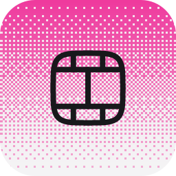

<p align="center">
  <picture>
    <source media="(prefers-color-scheme: dark)" srcset="./icon-dark.png" />
    
  </picture>
</p>

<div align="center">

# Clips

</div>

Agent-native Loom/Jam: capture and browse screen/timeline clips via the Shadow capture proxy.

> **The public home of `ryu-clips`.** Source, builds, and releases live here —
> binaries for every platform are attached to each release.
>
> This tree is generated from the Ryu monorepo, so commits pushed here
> directly are replaced on the next sync. **Pull requests are welcome** —
> open them here and they are ported into the monorepo, then flow back out.
> Ryu as a whole: https://github.com/amajorai/ryu

## Install

**App:** [Install](ryu://apps/@ryu/clips) (opens the Ryu desktop app and asks you to confirm)

**CLI:**

```bash
ryu apps add @ryu/clips
```

**Crate:**

```bash
cargo install ryu-clips
```

Prebuilt binaries for every platform are attached to [each release](https://github.com/amajorai/ryu/releases).

## License

Apache-2.0 — see [LICENSE](./LICENSE).

## Parts

- **`backend/` (`ryu-clips`)** — an extracted Core capability crate: the stable
  `/api/clips/*` HTTP surface that **proxies each call to the Shadow sidecar over loopback**.
  **Now served OUT-OF-PROCESS** by the `ryu-clips` bin (`[[bin]]`, `kind:local`, `public_mount`,
  `RYU_CLIPS_BIN`/`RYU_CLIPS_PORT`, default `:7992`) via the generic ext-proxy loader — Core links
  **zero clips code** (no path-dep, no `clips` cargo feature, no in-process `clips_routes`).
  It also owns `framesEndpoint` rewriting, the ingest orchestration (URL vs local-file
  resolution), and the summary render. Because the crate now runs standalone, its two former
  kernel couplings **degrade cleanly in the sidecar** rather than inverting through a Core
  `clips_host` shim (the Shadow record/browse half is fully live — the sidecar reads
  `RYU_SHADOW_URL` itself):
  - **yt-dlp ingest** — resolving a watched URL to a local video over Core's `DownloadCenter`
    (kernel binary management);
  - **auto-file into the `Clips` Space** — a finished clip's mp4 + summary stored in the
    `Clips` system Space (a Core store).
- **`ui/`** — a self-contained Path B Companion built with `RyuAppShell`, the shared
  `RyuAppToolbar`/`RyuAppMain`/`RyuAppSection`/`RyuAppList` primitives, and `@ryu/ui`
  controls. The bundled preview opens with an original local podcast video so playback,
  seeking, captions, clip selection, and the local-first Inspiration review lane can be
  inspected without a running Shadow sidecar. In Inspiration, left/right review actions
  copy a format brief into the current project or pass it; copied ideas can then be opened
  in the editor. When mounted in Ryu, capture and URL ingest reach the sidecar through the
  generic `app:http` bridge; the editor remains visibly marked as preview data.

## Fail-soft

When Shadow is down, handlers return `{ available: false, reason }` (the same shape as the
Shadow MCP provider) rather than a 5xx, so a stopped sidecar degrades gracefully in the UI.

## Build and test

```sh
bun run --cwd apps-store/clips/ui test
bun run --cwd apps-store/clips/ui check-types
bun run --cwd apps-store/clips/ui build
cargo test --manifest-path apps-store/clips/backend/Cargo.toml
```

The UI build emits one self-contained `ui/dist/index.html`. The Companion uses an
inlined demo video and poster; imported files remain in the browser preview and are not
uploaded by the UI.

## Manifest (Core fixture)

- **id** `@ryu/clips`, one `clips-companion` runnable, and the generic `app:http` host
  grant. The sidecar's `clips.view` and `clips.capture` permission levels remain the
  authority for the capture/ingest routes.
- **requires** app `shadow` (>=1.0.0) — it is a Core→Shadow proxy and depends on the Shadow
  capture app for its recordings.

## Surface

`/api/clips` (list) · `ingest` · `sources` · `recent-activity` · `start`, per-clip
`:id/{stop,pause,resume,context,frame,file,diagnostics}`.

## Core-vs-Gateway

Capture + bundle is "what runs" (Core/Shadow). Redacting diagnostics on egress is a Gateway
concern; v1 redacts client-side in the extension, so nothing here enforces policy.
